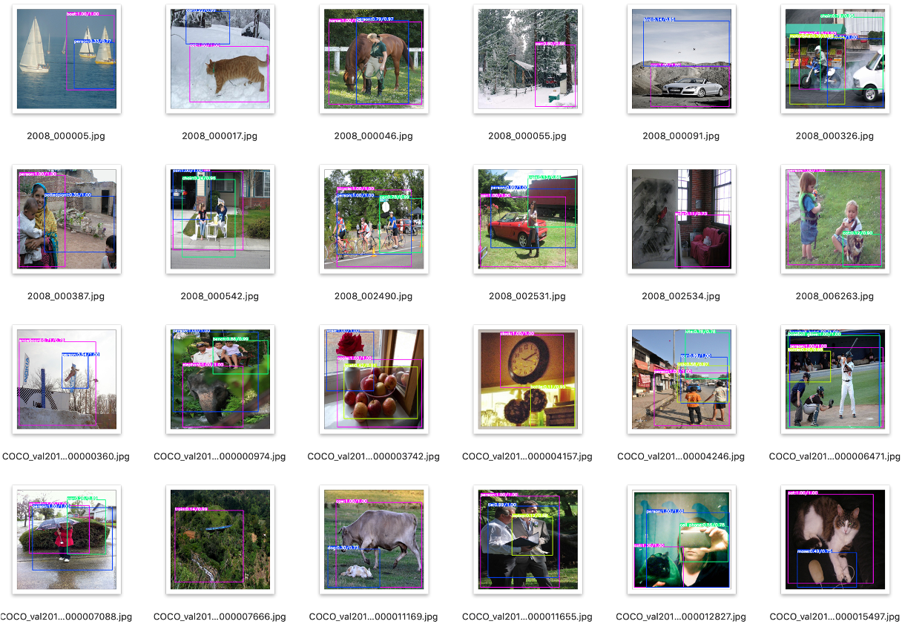

# MCAR.pytorch
This repository is a PyTorch implementation of [Learning to Discover Multi-Class Attentional Regions for Multi-Label Image Recognition](https://arxiv.org/abs/2007.01755). The paper is accepted at [IEEE Trans. Image Processing ([TIP 2021](https://signalprocessingsociety.org/publications-resources/ieee-transactions-image-processing)). This repo is created by [Bin-Bin Gao](https://csgaobb.github.io/).


### MCAR Framework


### Requirements

Please, install the following packages
- numpy
- torch-0.4.1
- torchnet
- torchvision-0.2.0
- tqdm


### Options
- `topN`: number of local regions
- `threshold`: threshold of localization 
- `ps`: global pooling style, e.g., 'avg', 'max', 'gwp'
- `lr`: learning rate
- `lrp`: factor for learning rate of pretrained layers. The learning rate of the pretrained layers is `lr * lrp`
- `batch-size`: number of images per batch
- `image-size`: size of the image
- `epochs`: number of training epochs
- `evaluate`: evaluate model on validation set
- `resume`: path to checkpoint

### MCAR Training and Evaluation

```sh
bash run.sh
```

| Model        | Input-Size | VOC-2007 | VOC-2012 | COCO-2014 |
| ------------ | ---------- | -------- | -------- | --------- |
| MobileNet-v2 | 256 x 256  | 88.1     | -        | 69.8      |
| ResNet-50    | 256 x 256  | 92.3     | -        | 78.0      |
| ResNet-101   | 256 x 256  | 93.0     | -        | 79.4      |
| MobileNet-v2 | 448 x 448  | 91.3     | [91.0](http://host.robots.ox.ac.uk:8080/anonymous/UB2GQR.html)     | 75.0      |
| ResNet-50    | 448 x 448  | 94.1     | [93.5](http://host.robots.ox.ac.uk:8080/anonymous/NKXC8W.html)     | 82.1      |
| ResNet-101   | 448 x 448  | 94.8     | [94.3](http://host.robots.ox.ac.uk:8080/anonymous/D9S0RH.html)     | 83.8      |

### MCAR Demo

```
bash run_demo.sh
```


## Citing this repository

If you find this code useful in your research, please consider citing us:

```
@inproceedings{MCAR_TIP_2021,
author = {Bin-Bin Gao, Hong-Yu Zhou},
title = {{Learning to Discover Multi-Class Attentional Regions for Multi-Label Image Recognition}},
booktitle = {IEEE Transactions on Image Processing (TIP)},
year = {2021}
}
```
## Reference
This project is based on the following implementations:
- https://github.com/durandtibo/wildcat.pytorch
- https://github.com/Megvii-Nanjing/ML_GCN

## Tips
If you have any questions about our work, please do not hesitate to contact us by emails.
